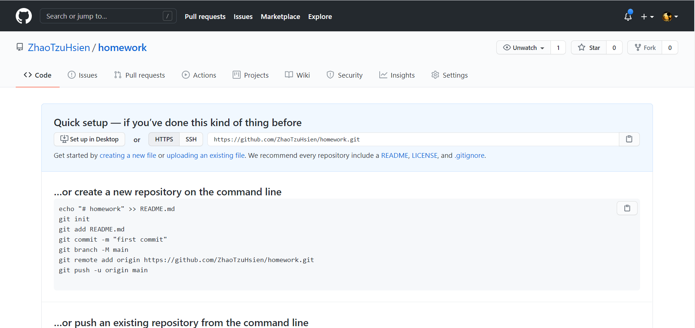

感謝大家願意參與專案並學習新知識，以下將會簡要說明作業的格式，請大家仔細閱讀。


## 建立 GitHub Repository

請登入 GitHub 並在自己的帳號下創建一個名為 homework 的 repository，往後的作業請 push 到這個資料夾中。




## 目錄結構

每份作業都會有自己的編號，請依照標號為每個作業創建新的資料夾，您的目錄結構可能會如下：

```
homework
    |- 0001
        |- node_modules
            |- ...
        |- package.json
        |- ...
    |- 0002
        |- ...
```

每個作業的資料夾可以視為一個獨立的專案，請記得先執行 `yarn init -y`，並安裝必要套件，確保作業能正確執行。

