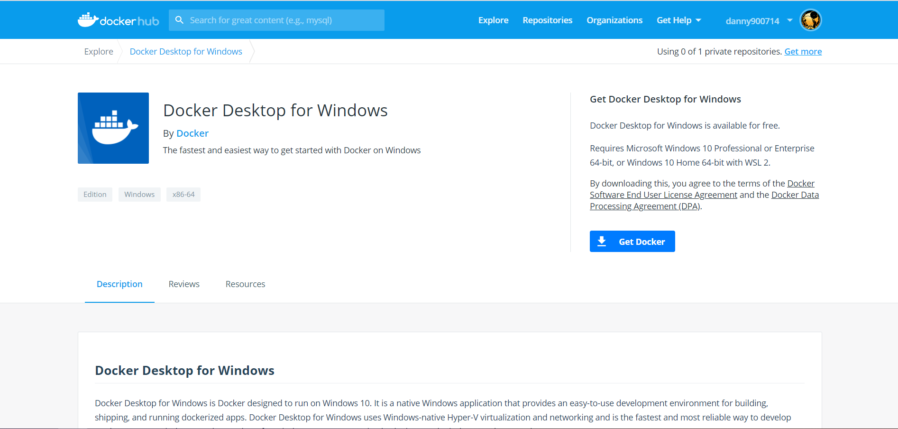
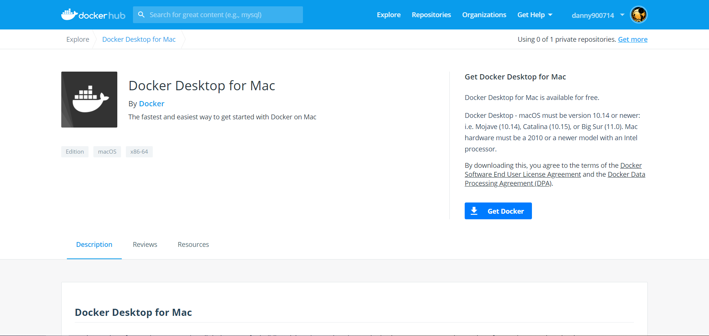

import Tabs from '@theme/Tabs';
import TabItem from '@theme/TabItem';

安裝 Kubernetes 是一個浩大工程，請根據您的作業系統依照指示安裝 Kubernetes。

## 安裝 Ubuntu

Kubernetes 是一個容器管理工具，因此我們必須先安裝容器系統，然而 **Windows 10 家用版** 並不支援容器系統，
好在 Windows 最近推出了 **WSL 2**，讓我們能在 Windows 中執行 Linux 子系統，
現在就讓我們來安裝 Linux 中最廣為人知的 Ubuntu 系統吧！

:::info
如果您的電腦為以下作業系統：

* Windows 10 **專業版**、**企業版**或**教育版**
* macOS

恭喜你，不需要安裝 Linux 系統即可執行 Docker，請直接跳到 [安裝 Docker](#安裝-docker)。
:::

<Tabs
    groupId="os"
    defaultValue="windows"
    values={[
        {label: 'Windows', value: 'windows'},
    ]}
>
<TabItem value="windows">

:::note 系統需求

* CPU 是 x64 架構
* Windows 10 作業系統，**版本 1903** 或更高，含**組件 18362** 或更高組件

:::


### 啟用 Windows 子系統 Linux 版

您必須先啟用「Windows 子系統 Linux 版」選用功能，然後才能在 Windows 上安裝任何 Linux 發行版本。

以系統管理員身分開啟 PowerShell 並執行：

```powershell title="PowerShell"
dism.exe /online /enable-feature /featurename:Microsoft-Windows-Subsystem-Linux /all /norestart
```

### 啟用虛擬機器功能

在安裝 WSL 2 之前，您必須啟用 **虛擬機器平台** 選用功能。

以系統管理員身分開啟 PowerShell 並執行：

```powershell title="PowerShell"
dism.exe /online /enable-feature /featurename:VirtualMachinePlatform /all /norestart
```

**重新啟動** 您的電腦，以完成 WSL 安裝並更新至 WSL 2。

### 下載 Linux 核心更新套件

下載 [WSL2 Linux 核心更新套件 (適用於 x64 電腦)](https://wslstorestorage.blob.core.windows.net/wslblob/wsl_update_x64.msi)
並執行更新套件。 \(按兩下以執行 - 系統會提示您提供更高的權限，請選取 [是] 以核准此安裝作業。\)

### 將 WSL 2 設定為預設版本

在安裝新的 Linux 發行版本時，開啟 PowerShell，然後執行下列命令，以將 WSL 2 設定為預設版本：

```powershell title="PowerShell"
wsl --set-default-version 2
```

### 安裝 Ubuntu 20.04.01

1. 開啟 Microsoft Store 中，Ubuntu 的 [應用程式畫面](https://www.microsoft.com/store/productId/9NBLGGH4MSV6)。

2. 從 Ubuntu 的安裝頁面中，選取 [取得]。
    
    

當您第一次啟動新安裝的 Linux 發行版本時，主控台視窗會隨即開啟，而系統會要求您等候一到兩分鐘，讓檔案解壓縮並儲存在您的電腦上。
未來的所有啟動時間都應該會低於一秒。

接著，您必須為新的 Linux 發行版本設定使用者帳戶和密碼。


**恭喜！您已成功安裝並設定與 Windows 作業系統完全整合的 Ubuntu 系統！**

</TabItem>
</Tabs>


## 安裝 Docker

Docker 是一個開源的容器管理系統，我們的 Kubernetes 將會以 Docker 作為執行環境。

<Tabs
    groupId="os"
    defaultValue="windows"
    values={[
        {label: 'Windows', value: 'windows'},
        {label: 'macOS', value: 'macos'},
    ]}
>
<TabItem value="windows">

### 下載 Docker Desktop for Windows

前往 Docker Hub [下載 Docker Desktop for Windows](https://hub.docker.com/editions/community/docker-ce-desktop-windows/)。



點擊右邊的 **Get Docker** 下載按鈕。

### 執行安裝檔

1. 雙擊 **Docker Desktop Installer.exe** 執行安裝精靈。
2. 在安裝程式中，打開 **Enable WSL 2 Features** 選項。
3. 授予權限給安裝精靈並依照指示完成安裝。
4. 當安裝精靈執行完畢，點即 **關閉** 按鈕。

### 啟動 Docker Desktop

在桌面找到 Docker Desktop 的圖示，或是在搜尋欄中搜尋 Docker Desktop，點擊來啟動 Docker Desktop。


當鯨魚圖示出現在電腦的工作列上時，代表 Docker Desktop 已經成功啟動了。


恭喜你，你現在成功在 Windows 10 家用版上成功執行 Docker 了。

</TabItem>
<TabItem value="macos">

:::note 系統需求

* **Mac 必須擁有 2010 或更新的硬體設備，並搭載 Intel 的 CPU**，
    且必須支援 memory management unit (MMU) virtualization，包含 Extended Page Tables (EPT) 和 Unrestricted Mode。
    可以執行以下指令來檢查 Mac 是否支援以上功能：
    ```bash
    sysctl kern.hv_support
    ```

    如果 Mac 支援 Hypervisor 架構，指令將會顯示：
    ```
    kern.hv_support: 1
    ```

* **macOS 的版本必須要是 10.14 或更新的版本**，包含 Mojave、Catalina 和 Big Sur
* 最少 4GB 的 RAM
* VirtualBox 4.3.30 或更舊的版本不可以安裝在電腦上

:::

### 下載 Docker Desktop for Mac

前往 Docker Hub [下載 Docker Desktop for Mac](https://hub.docker.com/editions/community/docker-ce-desktop-mac/)。



點擊右邊的 **Get Docker** 下載按鈕。


### 執行安裝檔

1. 雙擊 **Docker.dmg** 執行安裝精靈，並且將 Docker 圖示拉到 應用程式\(Applications\) 資料夾中。

    

2. 在 應用程式\(Applications\) 資料夾中雙擊 **Docker.app**。

    

3. 如果 Docker 的圖示出現在上方的狀態列，代表 Docker 已經成功執行了。

    

</TabItem>
</Tabs>


## 安裝 Minikube

Minikube 是本地端的 Kubernetes，讓我們能在自己的電腦中輕鬆部屬 Kubernetes，方便我們開發、測試和學習。

<Tabs
    groupId="os"
    defaultValue="windows"
    values={[
        {label: 'Windows', value: 'windows'},
        {label: 'macOS', value: 'macos'},
    ]}
>
<TabItem value="windows">

### 安裝 Chocolatey

Chocolatey 是 Windows 系統上的軟體管理工具，讓你能透過簡單的指令輕鬆的管理和升級軟體。

以系統管理員身分開啟 PowerShell 並執行：

```powershell title="PowerShell"
Set-ExecutionPolicy Bypass -Scope Process -Force; [System.Net.ServicePointManager]::SecurityProtocol = [System.Net.ServicePointManager]::SecurityProtocol -bor 3072; iex ((New-Object System.Net.WebClient).DownloadString('https://chocolatey.org/install.ps1'))
```

當指令執行完畢，您變可以開始使用 Chocolatey，如需完整的指令說明，請見 [Chocolatey 說明文件](https://docs.chocolatey.org/en-us/getting-started)。

### 使用 Chocolatey 安裝 Minikube

以系統管理員身分開啟 PowerShell 並執行：

```powershell title="PowerShell"
choco install minikube
```

當安裝程式詢問你是否執行安裝腳本時，請在指令列中輸入 A (代表允許所有的安裝腳本)。

</TabItem>
<TabItem value="macos">

### 下載並安裝 Minikube

開啟 **終端機** 並執行：

```bash
curl -LO https://storage.googleapis.com/minikube/releases/latest/minikube-darwin-amd64
sudo install minikube-darwin-amd64 /usr/local/bin/minikube
```

執行時系統會提示輸入您的密碼，請按照指使輸入。

</TabItem>
</Tabs>


## 執行 Minikube

Minikube 支援許多的驅動程式，這份教學中，我們會用剛剛安裝的 Docker 作為驅動程式。

將 Docker 作為 Minikube 預設的驅動程式，在終端機中執行以下指令：

```bash
minikube config set driver docker
```

接著在終端機執行以下指令啟動 Kubernetes Cluster：

```bash
minikube start
```

:::note

第一次執行時 Minikube 會下載 Kubernetes 映像檔，根據網路速度會影響到執行時間，一般而言，10 分鐘以內都屬正常狀況，請耐心等候。

:::

當您看到終端機上顯示：
```
🏄  Done! kubectl is now configured to use "minikube" cluster and "default" namespace by default
```
代表您的 Kubernetes Cluster 已經成功執行。


## 管理 Minikube

當您需要暫停 Kubernetes Clusters 時，請執行以下指令：

```bash
minikube pause
```

當您想要停止 Kubernetes Cluster 時，請執行以下指令：

```bash
minikube stop
```

如需刪除 Kubernetes Cluser 以重新開始新的 Cluster，請執行以下指令：

```bash
minikube delete
```


## 下一步

* [安裝開發工具](kubernetes/tools.mdx)
* 如果在安裝 WSL 2 時發生問題，請參照 [Windows 說明文件](https://docs.microsoft.com/zh-tw/windows/wsl/install-win10)
* 如果安裝 Docker 時發生問題，或想進一步了解 Docker 功能，請參照 [Docker 說明文件](https://docs.docker.com/get-docker/)
* 如需進一步了解 Chocolatey 指令，請參閱 [Chocloatey 說明文件](https://docs.chocolatey.org/en-us/choco/commands/)
* 如果安裝 Minikube 時發生問題，或想進一步了解 Minikube，請參閱 [Minikube 說明文件](https://minikube.sigs.k8s.io/docs/)
