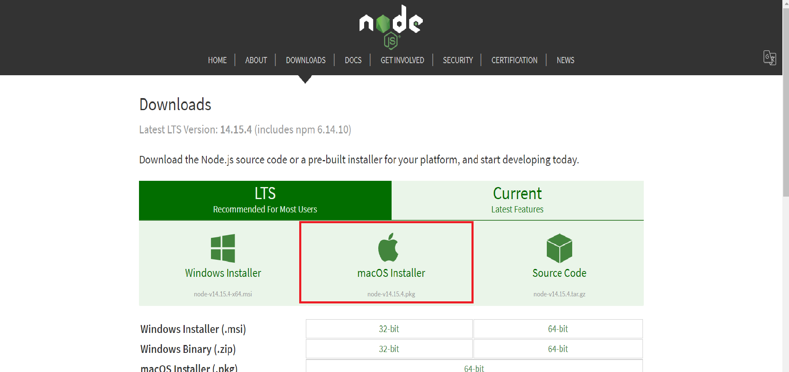

import Tabs from '@theme/Tabs';
import TabItem from '@theme/TabItem';

為了確保安裝的版本能得到長時間穩定的支援，我們統一安裝 LTS (Long Term Support) 版本。

## 安裝 LTS 版本的 Node.js

<Tabs
    groupId="os"
    defaultValue="windows"
    values={[
        {label: 'Windows', value: 'windows'},
        {label: 'macOS', value: 'macos'},
    ]}
>
<TabItem value="windows">

### 用 Chocolatey 安裝 Node.js (LTS)

以系統管理員身分開啟 PowerShell 並執行以下指令，如尚未安裝 Chocolatey，請參閱 [安裝 Chocolatey](appendix/chocolatey.mdx)：

```powershell title="PowerShell"
choco install nodejs-lts -y
```

安裝完成後，開啟指令列 (Powershell、CMD) 執行以下指令：

```powershell
node --version
```

如果安裝成功，系統便會顯示目前安裝的 Node.js 版本。

</TabItem>
<TabItem value="macos">

### 從官網安裝 Node.js (LTS)

從 [Node.js 官方下載頁面](https://nodejs.org/en/download/) 下載 LTS 版本的 macOS Installer。



下載完成後，請雙擊執行安裝檔。

安裝完成後，開啟終端機執行以下指令：

```bash
node --version
```

如果安裝成功，系統便會顯示目前安裝的 Node.js 版本。

</TabItem>
</Tabs>


## 安裝 Yarn

儘管 Node.js 自帶一個套件安裝管理工具 npm，npm 在安裝套件時卻因為缺乏良善的特見快取系統導致安裝速度緩慢，而 Yarn 除了改善這方面的問題，
也藉由 yarn.lock 檔案的設計提高安全性，防止中介軟體趁安裝時偽裝成正版套件，因此我們採用 Yarn v1 版本來代替 npm 作為套件管理工具。

<Tabs
    groupId="os"
    defaultValue="windows"
    values={[
        {label: 'Windows', value: 'windows'},
        {label: 'macOS', value: 'macos'},
    ]}
>
<TabItem value="windows">

### 使用 Chocolatey 安裝 Yarn

以系統管理員身分開啟 PowerShell 並執行以下指令，如尚未安裝 Chocolatey，請參閱 [安裝 Chocolatey](appendix/chocolatey.mdx)：

```powershell title="PowerShell"
choco install yarn -y
```

安裝完成後，開啟指令列 (Powershell、CMD) 執行以下指令：

```powershell
yarn --version
```

如果安裝成功，系統便會顯示目前安裝的 Yarn 版本。

</TabItem>
<TabItem value="macos">

### 使用安裝腳本安裝 Yarn

開啟終端機執行以下指令：

```bash
curl -o- -L https://yarnpkg.com/install.sh | bash
```

安裝完成後，開啟終端機執行以下指令：

```bash
yarn --version
```

如果安裝成功，系統便會顯示目前安裝的 Yarn 版本。

</TabItem>
</Tabs>
