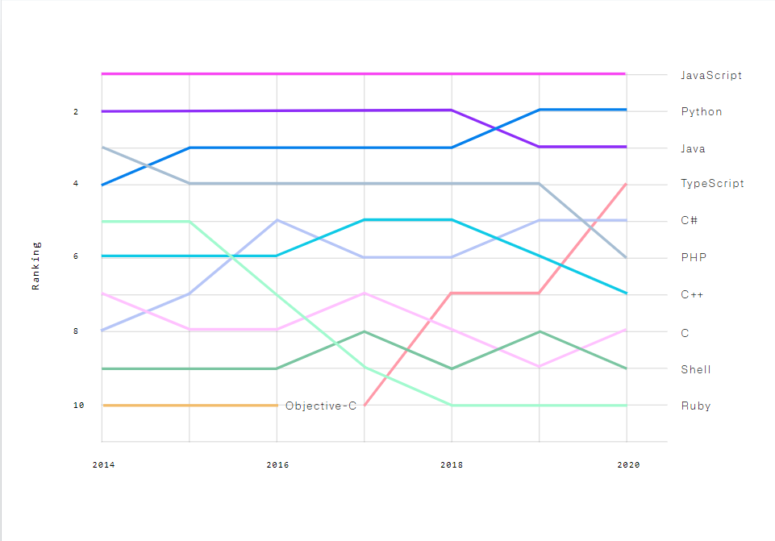

## Node.js 是什麼

Node.js 是建構在 [Google V8 引擎](https://zh.wikipedia.org/wiki/V8_(JavaScript%E5%BC%95%E6%93%8E)) 上的 JavaScript 執行環境。
在 Node.js 出現之前，JavaScript 通常作為前端程式設計語言使用，以 JavaScript 寫出的程式常在使用者的瀏覽器上執行。Node.js 的出現使JavaScript也能用於伺服器端編程，讓 JavaScript 成為在前後端都極具應用性的語言。

## 熱門程度

拜 Node.js 所賜，JavaScript 已長期霸佔程式霸主的地位，且有其最熱門的套件管理工具 npm，使得 JavaScript 的排名高居不下。
近年來 JavaScript 的應用範圍又跨足桌面應用程式和手機應用程式，我們常用的 Facebook、Instagram 一部分的程式便是由 JavaScript 編寫，應用性相當高。
因此，學習 JavaScript 絕對是能讓你同時掌握最多技術的程式語言！

## 下一步

- [安裝 Node.js](nodejs/installation.mdx)
