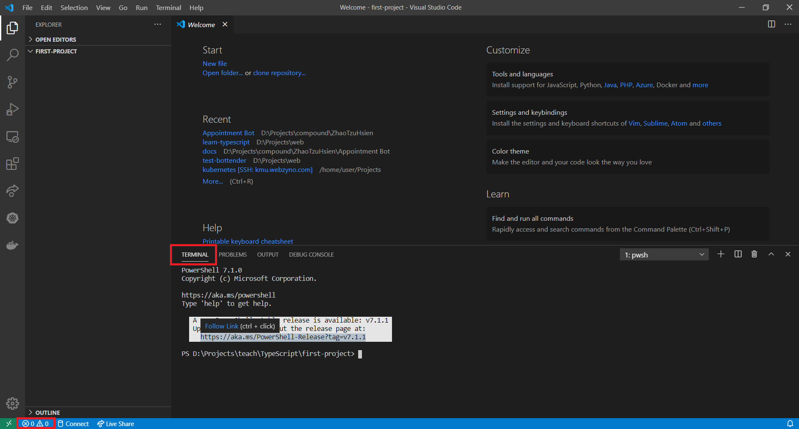

從這篇文章開始，會教大家藉由實作的方式學習 TypeScript 的語法，請大家仔細閱讀教學內容。

## 建立專案

請建立一個新資料夾，在這個專案中，我們將它命名為 first-project，接著用 Visual Studio Code 開啟剛剛建立的空資料夾，開啟資料夾的方式為：**"File" > "Open Folder..."**。

開啟資料後，點擊下方的 **「錯誤與警告」** 按鈕，並點擊 **TERMINAL** 標籤開啟終端機。



### 初始化專案

在終端機輸入以下指令：

```bash
yarn init -y
```

這個指令會用預設的設定在 first-project 資料夾中建立一個新專案，如需了解初始化專案的選項，請參閱[官方文件](https://yarnpkg.com/cli/init)。
當指令成功執行後，你會發現資料夾中多了一個 package.json 的檔案，這個就是我們專案的設定檔，裡頭紀錄了專案的名稱、版本、相依套件等等……，開啟檔案將會發現以下內容：

```json title="package.json"
{
  "name": "first-project",
  "version": "1.0.0",
  "main": "index.js",
  "license": "MIT"
}
```

我們可以發現 package.json 中有四個欄位：
1. name: 專案的名稱
2. version: 專案的版本，使用 [SemVer 格式](https://semver.org/lang/zh-TW/)
3. main: 程式執行時的進入點，相當於 C 語言的 main 函式
4. license: 開法原始碼的授權類型，預設為 MIT

### 安裝 TypeScript

專案初始化完成後，我們開始在專案中新增 TypeScript 相依套件吧！請執行以下指令：

```bash
yarn add -D typescript
```

等指令執行完畢後，TypeScript 就被新增到專案的 devDependencies 了，這時資料夾中會多一個 `node_modules` 資料夾，
裡頭存放的是程式庫的檔案，其中的內容我們不須改動，因為 `yarn` 會負責處裡程式庫的下載和安裝。

如果打開 `package.json`，會發現多了幾行內容：

```json {6-8} title="package.json"
{
  "name": "first-project",
  "version": "1.0.0",
  "main": "index.js",
  "license": "MIT",
  "devDependencies": {
    "typescript": "^4.1.3"
  }
}
```

在 `package.json` 中，除了上述的 4 個欄位外，最重要的就是 dependencies 和 devDependencies 欄位了，其中
- dependencies 代表專案所使用的函式庫，在執行的時候會被呼叫
- devDependencies 為僅在開發時會用到的函式庫，在執行階段不會使用到

因為 TypeScript 是我們的編譯器，在執行階段並不會用到它，因此我們將它以 devDependencies 的方式安裝即可，
而剛剛執行的 `yarn` 指令中，`-D` 參數就是告訴 yarn 把程式庫以 devDependencies 的方式安裝，如果沒有加上這個參數，
程式庫就會以 dependencies 的方式安裝喔。

### 產生 tsconfig.json

打開終端機並執行以下指令：

```bash
yarn tsc --init
```

這會在我們專案的跟目錄產生一個預設的 tsconfig.json 檔案，這是 TypeScript 編譯器的設定檔，詳細的內容會在 [tsconfig.json 介紹](#tsconfigjson-介紹) 中說明。

### 新增程式檔

最後，我們新增 `src` 資料夾，並在 `src` 資料夾中新增 `index.ts` 檔案：

```typescript title="index.ts"
console.log('Hello world!');
```

恭喜你已經完成專案創建，接下來將會介紹各個檔案的功能和執行程式的方式。


## 目錄結構

```
first-project
  |- node_modules
    |- ....
  |- src
    |- index.ts
  |- package.json
  |- tsconfig.json
  |- yarn.lock
```

剛才已經有介紹 node_modules 和 package.json 的功能了，現在我們來講講 src 資料夾。

儘管 TypeScript 會編譯除了程式庫以外所有資料夾中的程式檔，程式設計師還是習慣將程式碼放在 `src` 資料夾中，這種大家都這麼做但卻又沒有硬性規定的規範稱作 **傳統（convension）**，
了解 convension 非常重要，這讓程式設計師們能夠用彼此都能理解的方式溝通，避免不必要的混亂情形。

另外一個重要的檔案則是 `yarn.lock`，但我們不必管理其中的內容，它最主要的目的是紀錄套件的資料以及雜湊值，確保安裝過程的安全性，
從名字我們不難理解它是受 yarn 所管理，我們要注意的是記得要把這個檔案加到版本控制系統當中，確保其他協作的人安裝的套件和你是同個版本。


## tsconfig.json 介紹

TypeScript 中最重要的莫過於這個 tsconfig.json 設定檔了，它決定了 TypeScript 編譯器如何編譯你的程式碼，對於專案的維護至關重要。

如果打開預設的 tsconfig.json，會發現以下內容：

```json title="tsconfig.json"
{
  "compilerOptions": {
    /* Visit https://aka.ms/tsconfig.json to read more about this file */

    /* Basic Options */
    // "incremental": true,                   /* Enable incremental compilation */
    "target": "es5",                          /* Specify ECMAScript target version: 'ES3' (default), 'ES5', 'ES2015', 'ES2016', 'ES2017', 'ES2018', 'ES2019', 'ES2020', or 'ESNEXT'. */
    "module": "commonjs",                     /* Specify module code generation: 'none', 'commonjs', 'amd', 'system', 'umd', 'es2015', 'es2020', or 'ESNext'. */
    // "lib": [],                             /* Specify library files to be included in the compilation. */
    // "allowJs": true,                       /* Allow javascript files to be compiled. */
    // "checkJs": true,                       /* Report errors in .js files. */
    // "jsx": "preserve",                     /* Specify JSX code generation: 'preserve', 'react-native', or 'react'. */
    // "declaration": true,                   /* Generates corresponding '.d.ts' file. */
    // "declarationMap": true,                /* Generates a sourcemap for each corresponding '.d.ts' file. */
    // "sourceMap": true,                     /* Generates corresponding '.map' file. */
    // "outFile": "./",                       /* Concatenate and emit output to single file. */
    // "outDir": "./",                        /* Redirect output structure to the directory. */
    // "rootDir": "./",                       /* Specify the root directory of input files. Use to control the output directory structure with --outDir. */
    // "composite": true,                     /* Enable project compilation */
    // "tsBuildInfoFile": "./",               /* Specify file to store incremental compilation information */
    // "removeComments": true,                /* Do not emit comments to output. */
    // "noEmit": true,                        /* Do not emit outputs. */
    // "importHelpers": true,                 /* Import emit helpers from 'tslib'. */
    // "downlevelIteration": true,            /* Provide full support for iterables in 'for-of', spread, and destructuring when targeting 'ES5' or 'ES3'. */
    // "isolatedModules": true,               /* Transpile each file as a separate module (similar to 'ts.transpileModule'). */

    /* Strict Type-Checking Options */
    "strict": true,                           /* Enable all strict type-checking options. */
    // "noImplicitAny": true,                 /* Raise error on expressions and declarations with an implied 'any' type. */
    // "strictNullChecks": true,              /* Enable strict null checks. */
    // "strictFunctionTypes": true,           /* Enable strict checking of function types. */
    // "strictBindCallApply": true,           /* Enable strict 'bind', 'call', and 'apply' methods on functions. */
    // "strictPropertyInitialization": true,  /* Enable strict checking of property initialization in classes. */
    // "noImplicitThis": true,                /* Raise error on 'this' expressions with an implied 'any' type. */
    // "alwaysStrict": true,                  /* Parse in strict mode and emit "use strict" for each source file. */

    /* Additional Checks */
    // "noUnusedLocals": true,                /* Report errors on unused locals. */
    // "noUnusedParameters": true,            /* Report errors on unused parameters. */
    // "noImplicitReturns": true,             /* Report error when not all code paths in function return a value. */
    // "noFallthroughCasesInSwitch": true,    /* Report errors for fallthrough cases in switch statement. */
    // "noUncheckedIndexedAccess": true,      /* Include 'undefined' in index signature results */

    /* Module Resolution Options */
    // "moduleResolution": "node",            /* Specify module resolution strategy: 'node' (Node.js) or 'classic' (TypeScript pre-1.6). */
    // "baseUrl": "./",                       /* Base directory to resolve non-absolute module names. */
    // "paths": {},                           /* A series of entries which re-map imports to lookup locations relative to the 'baseUrl'. */
    // "rootDirs": [],                        /* List of root folders whose combined content represents the structure of the project at runtime. */
    // "typeRoots": [],                       /* List of folders to include type definitions from. */
    // "types": [],                           /* Type declaration files to be included in compilation. */
    // "allowSyntheticDefaultImports": true,  /* Allow default imports from modules with no default export. This does not affect code emit, just typechecking. */
    "esModuleInterop": true,                  /* Enables emit interoperability between CommonJS and ES Modules via creation of namespace objects for all imports. Implies 'allowSyntheticDefaultImports'. */
    // "preserveSymlinks": true,              /* Do not resolve the real path of symlinks. */
    // "allowUmdGlobalAccess": true,          /* Allow accessing UMD globals from modules. */

    /* Source Map Options */
    // "sourceRoot": "",                      /* Specify the location where debugger should locate TypeScript files instead of source locations. */
    // "mapRoot": "",                         /* Specify the location where debugger should locate map files instead of generated locations. */
    // "inlineSourceMap": true,               /* Emit a single file with source maps instead of having a separate file. */
    // "inlineSources": true,                 /* Emit the source alongside the sourcemaps within a single file; requires '--inlineSourceMap' or '--sourceMap' to be set. */

    /* Experimental Options */
    // "experimentalDecorators": true,        /* Enables experimental support for ES7 decorators. */
    // "emitDecoratorMetadata": true,         /* Enables experimental support for emitting type metadata for decorators. */

    /* Advanced Options */
    "skipLibCheck": true,                     /* Skip type checking of declaration files. */
    "forceConsistentCasingInFileNames": true  /* Disallow inconsistently-cased references to the same file. */
  }
}
```

由於能改動的參數實在太多了，我們只會著重幾個重要的參數作介紹，如需完整的參考資料，請參閱 [TypeScript: TSConfig Reference - Docs on every TSConfig option](https://www.typescriptlang.org/tsconfig)。

### 指定編譯資料夾

由於我們的程式檔只會放在 src 資料夾中，其他資料夾的內容不需要被編譯，因次我們可以加入 `include`，告訴 TypeScript 哪些資料夾是要被編譯的，
如果沒有指定這個選項，預設在資料夾中（包括所有子資料夾）檔名以 `.ts` 結尾的所有檔案都會被編譯（node_modules 資料夾除外）。

```json {2} title="tsconfig.json"
{
  "include": ["src/**/*"],
  "compilerOptions": {
    /* Visit https://aka.ms/tsconfig.json to read more about this file */
    /* other options ... */
  }
}
```

### 編譯 JS 版本

由於我們的 Line Bot 會在 Node.js 14 LTS 的版本上執行，而 Node.js 14 支援 ES2020 的語法，因此我們將 `target` 改為 ES2020，
讓 TypeScript 不必將 JavaScript 編譯成低版本的 JavaScript。

```json {8} title="tsconfig.json"
{
  /* other options ... */
  "compilerOptions": {
    /* Visit https://aka.ms/tsconfig.json to read more about this file */
    
    /* Basic Options */
    // "incremental": true,                   /* Enable incremental compilation */
    "target": "ES2020",                       /* Specify ECMAScript target version: 'ES3' (default), 'ES5', 'ES2015', 'ES2016', 'ES2017', 'ES2018', 'ES2019', 'ES2020', or 'ESNEXT'. */
    "module": "commonjs",                     /* Specify module code generation: 'none', 'commonjs', 'amd', 'system', 'umd', 'es2015', 'es2020', or 'ESNext'. */
    /* other options ... */
  }
}
```

### 輸出目錄

TypeScript 預設將編譯輸出的檔案放在和 `.ts` 檔一樣的位置，然而這會導致 src 資料夾中同時有 TypeScript 和 JavaScript 的檔案，
這會使得專案變得非常的雜亂，因此我們修改 `outDir` 參數，將編譯後的檔案統一放在 `outDir` 中，也讓版本控制系統能將這些檔案排除。

```json {8} title="tsconfig.json"
{
  /* other options ... */
  "compilerOptions": {
    /* Visit https://aka.ms/tsconfig.json to read more about this file */
    
    /* other options ... */
    // "outFile": "./",                       /* Concatenate and emit output to single file. */
    "outDir": "./dist",                       /* Redirect output structure to the directory. */
    // "rootDir": "./",                       /* Specify the root directory of input files. Use to control the output directory structure with --outDir. */
    /* other options ... */
  }
}
```

我們叫 TypeScript 將編譯後的程式碼放在 dist 資料夾，dist 和 build 都是常見的選項。

以上簡單介紹 `tsconfig.json` 常見的設定參數，如果對 json 的檔案格式不太了解，請參閱 [Json 語法教學](https://developer.mozilla.org/zh-TW/docs/Learn/JavaScript/Objects/JSON)。

## 執行程式

TypeScript 本身是無法直接執行的，需要被編譯成 JavaScript 才能在瀏覽器或是 Node.js 上執行，這個章節會告訴大家如何執行你寫的 TypeScript 程式。

### 編譯 TypeScript 程式碼並執行

最正統的方式就是先將 TypeScript 編譯成 JavaScript，再用 `node` 指令執行編譯後的 JavaScript。

要編譯 TypeScript 檔案，請開啟終端機並執行以下指令：

```bash
yarn tsc
```

這時我們打開 dist 資料夾，就會發現裡頭有編譯過後的 index.js，這個檔案可以被 Node.js 執行，請執行以下指令：

```bash
cd dist
node index.js
```

如果成功顯示 `Hello world!`，恭喜你，你已經完成第一支 TypeScript 程式。

### 利用 ts-node 來執行

然而，每次都要執行那麼多指令想必非常麻煩，為了方便開發，便有高手寫出一個叫 `ts-node` 的指令，它可以直接執行 TypeScript 程式碼，
省去打指令編譯 TypeScript 的麻煩。

安裝 `ts-node`：

```bash
yarn add -D ts-node
```

為了讓 ts-node 更方便使用，我們修改 `package.json` 的內容，讓指令的長度縮短，也方便大家執行。

```json {4,6-8} title="package.json"
{
  "name": "first-project",
  "version": "1.0.0",
  "main": "src/index.ts",
  "license": "MIT",
  "scripts": {
    "start": "ts-node ."
  },
  "devDependencies": {
    "ts-node": "^9.1.1",
    "typescript": "^4.1.3"
  }
}
```

我們改變 `main` 的設定，將它改為程式碼所在的位置，好讓 ts-node 知道程式預設的進入點是哪裡。

而玲外一個改動則是新增了 `scripts` 物件到 `package.json` 中，這個 `scripts` 是相當特殊的物件，裡頭每個屬性的名稱都會變成 yarn 的子命令，
以上面的例子來看，我們只要執行

```bash
yarn start
```

事實上 yarn 就會幫我們執行

```bash
yarn ts-node .
```

如此就可以用較短且好理解的名稱來封裝複雜的命令，是不是很方便呢？

當你執行 `yarn start`，而螢幕上顯示 `Hello world!`，就代表你設定成功囉！


## 下一步
- [變數與註解](typescript/variable-and-comment.mdx)
- [Json 語法教學](https://developer.mozilla.org/zh-TW/docs/Learn/JavaScript/Objects/JSON)
