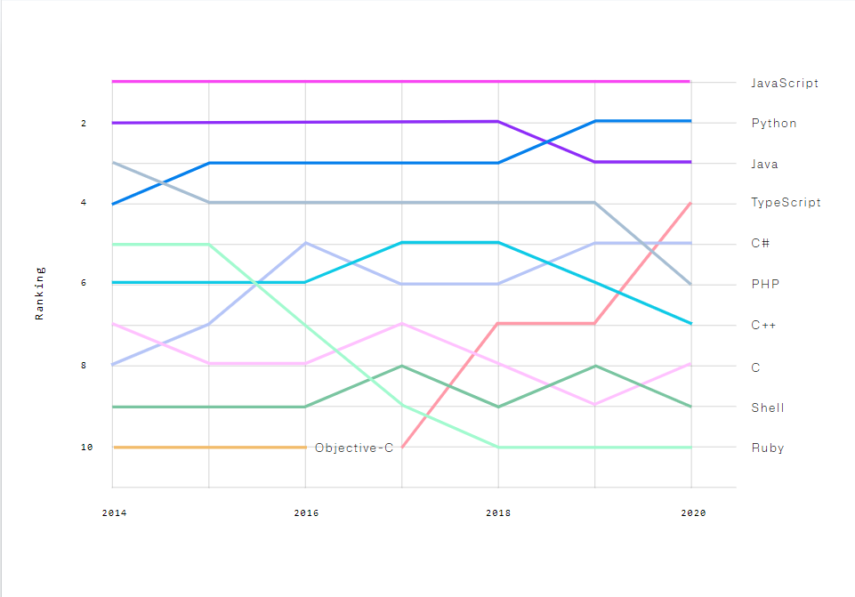

TypeScript 是由 Microsoft 主打，擁有型別系統（Type System）與介面（Interface）設計的語言，它可以說是 JavaScript 的超集，
讓 JavaScript 更好維護，減少開發者在除厝時所花的時間成本。

官網：[TypeScript: Typed JavaScript at Any Scale.](https://www.typescriptlang.org/)

## 運作原理

藉由 TypeScript 的編譯器 `tsc` 將 TypeScript 的程式碼編譯成 JavaScript 的程式碼，便可在瀏覽器或 Node.js 上執行。

編譯過程中，`tsc` 會依據設定檔檢查程式碼有無潛藏的錯誤，如果發現錯誤，便會丟出錯誤訊息並終止編譯，防止有問題的程式碼直接執行，降低除錯成本。

## 優點

### 型別系統（Type System）

TypeScript 最主要的優勢就是型別系統了，對於只接觸 Python 的大家可能很難理解型別是甚麼。簡單來說，在 Python 中我們要宣告一個變數時可能會長這樣：

```python title="Python"
name = 'Danny' # name 這裡被指定為 'Danny'，而 Python 的直譯器則會將 name 的型別推論成 str
```

然而當我們在 TypeScript 中宣告變數時，需要明確指定它的型別：

```typescript title="TypeScript"
let name: string = 'Hello'; // name 後方的 : 以及 string 即是 TypeScript，而 name 被指定為只能儲存 string 的變數
```

那這樣的型別系統有麼好處呢？其實最主要的好處就是能防止不正確的變數值被指派到變數，同時也讓 IDE 能夠提供 Auto Complete 的功能。
讓我們看看以下例子：

```python title="Python"
name = 'Danny'; # name 這裡被指定為 'Danny'，而 Python 的直譯器則會將 name 的型別推論成 str
name = 123; # 將 name 指定為數值 123，Python 直譯器不會顯示錯誤
```

如果在 TypeScript 編譯相同程式碼，則會出現錯誤：

```typescript title="TypeScript"
let name: string = 'Hello';
name = 123; // 這行會丟出 error TS2322: Type 'number' is not assignable to type 'string'.
```

在 TypeScript 中，每個變數都有它自己的型別，也因此當指派錯誤型別的變數值到變數中時，TypeScript 的編譯器就會檢測出來並提醒開發者這邊的程式碼有問題，
讓開發者不會因意外指派數字給 name。

在 IDE 中，因為 IDE 能清楚了解變數是什麼型態，也就能提供相應的 Auto Complete 功能，讓開發更有效率。


除此之外，型別系統也就意味著會有相對完整的物件導向程式設計，相關的內容將會在後面幾篇詳述。


### 擴充 ECMAScript

各位想必對 ECMAScript 是什麼還不太了解，大家可以這麼想：網際網路、瀏覽器發展歷史已久，起初各大瀏覽器與公司都是實作自己版本的 JavaScript 語法以及相對應驅動 JavaScript 的引擎，對於互動式網頁設計的需求也不斷新增。

在這種完全沒有標準規範下的混沌中誕生了 ES，也就是正式的 JavaScript 語法規範，而現在大部分主流瀏覽器都已經完全實作出 ES5 （第五版），大部分初學 JavaScript 基本上也都是在這個版本下的規範。

不過如果細看 ES 發展歷史 —— ES3 跟 ES5 間隔了整整 10 年，後來差不多隔了將近 6 年的時間，ES6（又名 ES2015、Harmony，第六版）才正式釋出。

這間隔實在太恐怖，因此後來規範每一年都會釋出新的 ES 版本，使得更新上不會一次有太多的新語法或新特性蹦出來。因此到去年 2020 年，已經釋出到的版本應當是 ES2020 了（2016年以後的版本習慣以 ES 加上年份來命名）！更新速度看起來很快，但是 ES2016 ~ ES2020 更新上的東西不會像 ES6 (ES2015) 一樣多到那麼誇張。另外，我們也稱 ES2020 以後的版本，也就是還未釋出的版本為 ESNext，因此聽到這些名詞也不需要覺得陌生，可以想成 JavaScript 進化到哪一個程度的指標。

而 TypeScript 則可以讓我們自由選擇要用哪一個 ES 版本來開發，也可以指定編譯出來的 JavaScript 是哪個版本，如此以來，我們就不必擔心因為平台的限制而不能使用最新的語法了。


## 熱門程度

一個語言的熱門程度也就代表社群的多寡，也會影響到好用工具的數量。



還記得在 Node.js 教學裡的那張圖嗎？大家仔細看看 TypeScript，可以發現它絕對是近幾年來串升速度最快的程式語言。
因為它的型別特性使得 JavaScript 的開發變得更順手，同時他又兼容於 JavaScript 的專案，在 TypeScript 中也可使用 JavaScript 的程式庫，造就 TypeScript 如此防大的社群。

如果大家對前端框架有興趣，更會發現 [Angular](https://angular.io/) 只支援 TypeScript，直接捨棄 JavaScript 凌亂的語法，不難看出 TypeScript 是新一代最強悍的程式語言。
